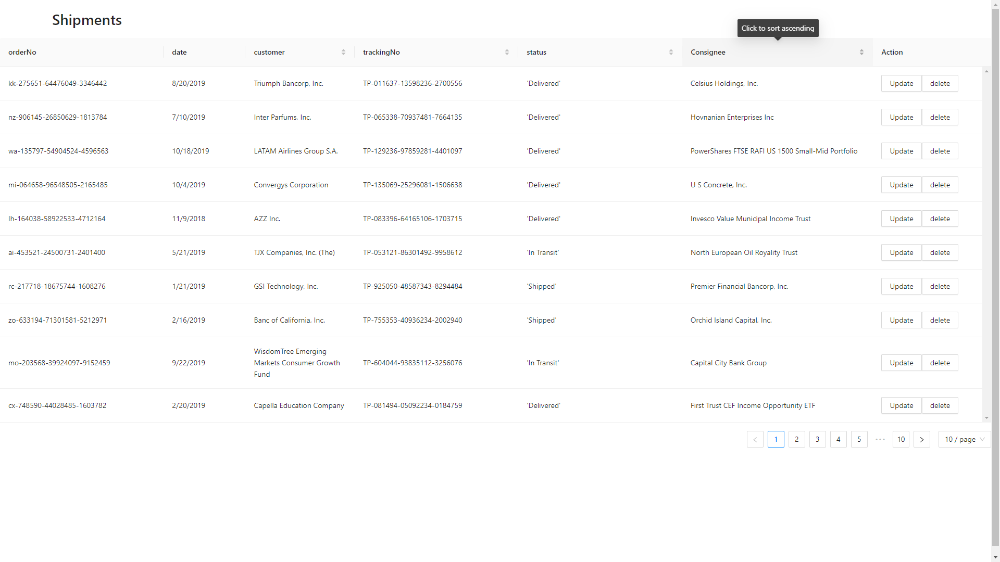
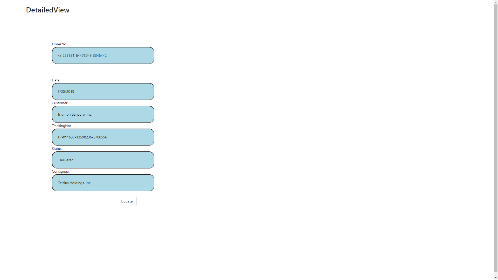

# Project Name: Shipments
### Author: Hans-Märten Liiu
 

Main Idea:
-------------

Load shipments data with AJAX from https://my.api.mockaroo.com/shipments.json?key=5e0b62d0 or Shipments file
Display data in generated table (see attachment ShipmentsTable.png as example) 
Provide a button in the table to open a panel to visualize details of single row (see attachment ShipmentsDetails.png as example) 

## Application functional details:
* You can see shipment listings
* You can remove shipment listing
* You can update shipment listing data

 

## How to boot the application:
* Open CMD, then cd into the folder where you can see src and public folder. After that you have to enter command: npm install. When npm install is finished you can launch the application with npm start.

 

## Images of the application
* Main Page

* Update page

 

